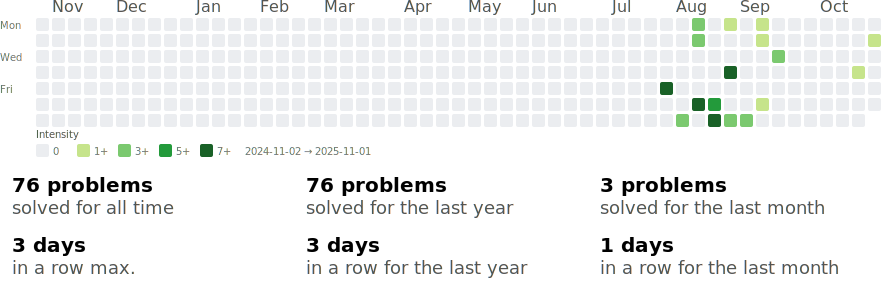

### Progress (last 12 months) across all coding platforms

# Solutions
> Here you can find all my solutions and sometimes explanations to them

## Codeforces

## CSES
### [Introductory Problems](./CSES/0.Solutions/01.%20introduction.md)

### [Sorting & Searching](./CSES/0.Solutions/02.%20sorting_searching.md)

### [Dynamic Programming](./CSES/0.Solutions/03.%20Dynamic%20Programming.md)

## AtCoder

## Codechef

## USACO

## University
